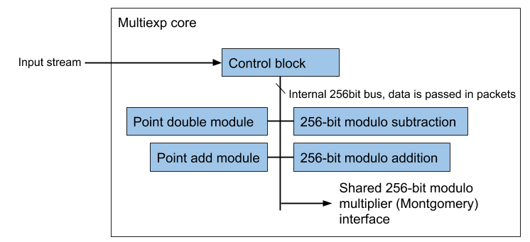

Multi-exponentiation in G1 
======================

 ## Architecture ##

The top level architecture consists of control logic and log-n (we selected  n = 2) multiplexors and de-multiplexors for evenly distributing the input stream of data across the array of multiexp cores. Once each core has computed its result (a subset of the multiexp result), the points are collapsed within the core array into a single final result which is loaded back into DDR memory and can be read by the host. The algorithm used does not pre-compute as this was require too much memory on the FPGA. We use a batched method to calculate the multi-exponentiation which takes on average KEY_BITS (256) * NUM_IN iterations. This can be broken down into KEY_BITS point doubles and (KEY_BITS * NUM_IN * 0.5) point adds.

Each core operates on a subset of the inputs (Montgomery form Jacobian coordinates and scalar pairs), and the inputs are read in a streaming loop. This means the DDR reads are done back to back and will read in bursts all the input points for each bit in the 256 scalar. Note this does not create a bottle neck in the system due to the actual point operations taking longer than the DDR read.

Internally each core has a module that can perform point doubling, point addition, and a dedicated modulo adder and modulo subtractor.

For example if the kernel has been compiled with 16 cores, then each core will get 1/16 of the total inputs. After each core has its final result, they are collapsed into each other log2 - so in the case of 16 cores there would be another 4 stages of point addition done before the final Montgomery form Jacobian coordinate point is streamed back to host.

## Kernel base performance and area utilization ##
The kernel when synthesized for a single core and single arithmetic unit  are shown below (bracket values are % of a VU9P AWS FPGA).
Other resource types (BRAMs, LUTRAMs, etc) are not shown because their usage is very low. This includes glue logic of the kernel, and won't include the other top level logic AWS inserts, so is just a rough guide.

The kernel was able to operate at 290MHz with 16 cores. It used the following resources in total:

| FF |  LUT | DSP| 
| --- | --- | --- |
| 10500 (3.96) | 92245 (7.80) | 450 (6.58) |

Each additional core adds ~10.5K FFs and ~12.5K LUTs. Each multiplier unit adds ~50K FFs, 23K LUTs, and 480 DSPs.

## Simulated performance ##
The table below shows the performance and area trade off when increasing cores or increasing arithmetic units. FMax here shows the maximum frequency that was achieved during a 
out of context run, and due to quantization effects when assembling multiple kernels might change. Throughput was simulated over a small number of points (32), but it is enough to 
saturate the cores operating in parallel, so that performance would roughly be linear with increase of input points.

| Number of Cores | Number of Arithmetic units | Throughput (point/s) | 
| --- | --- | --- | 
| 1 | 1 | 8.294K | 
| 2 | 1 | 11.112K | 
| 4 | 1 | 17.512K | 
| 4 | 2 | 17.720K | 
| 8 | 1 | 29.051K | 
| 8 | 2 | 31.676K | 
| 16 | 1 | 44.558K | 
| 16 | 2 | 47.393K | 
| 32 | 1 | 48.945K |
| 32 | 2 | 69.487K |

It seems you probably want around 1 arithmetic unit per 16 cores to avoid losing performance. After ~30 cores the LUT usage forces the placement to be spanning super logic regions (SLRs), and performance is impacted heavily. So the kernel was programmed with 16 cores and 1 arithmetic unit.